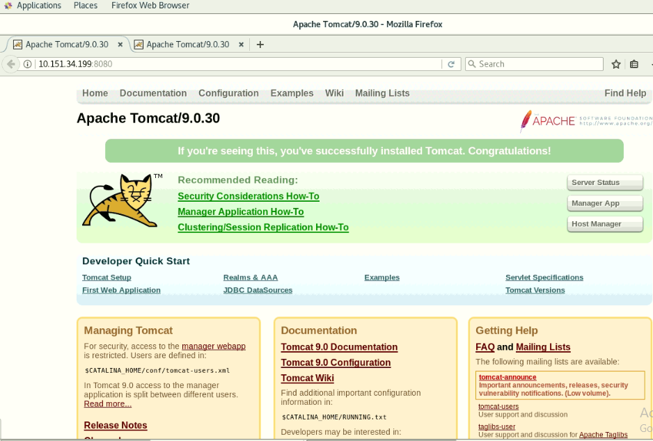
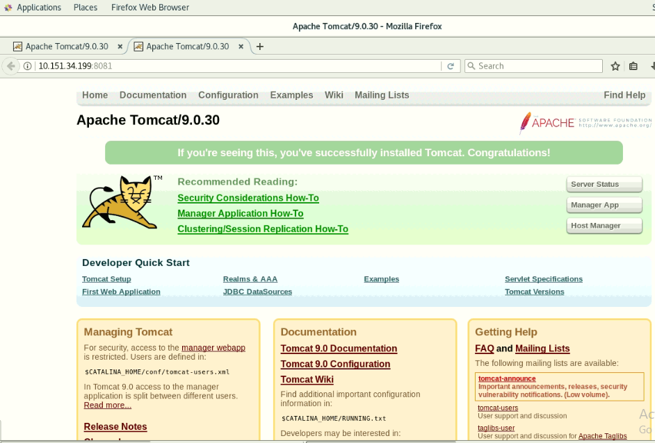
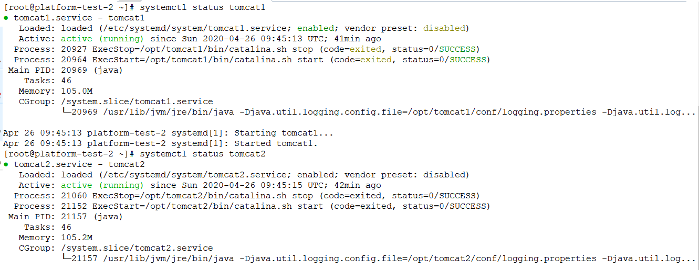
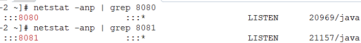
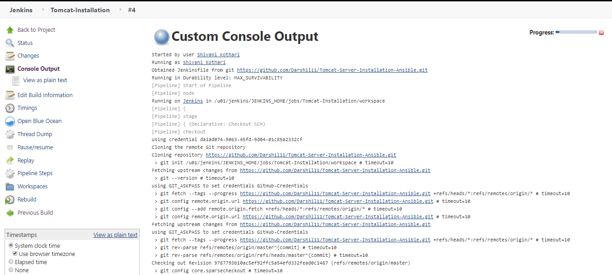
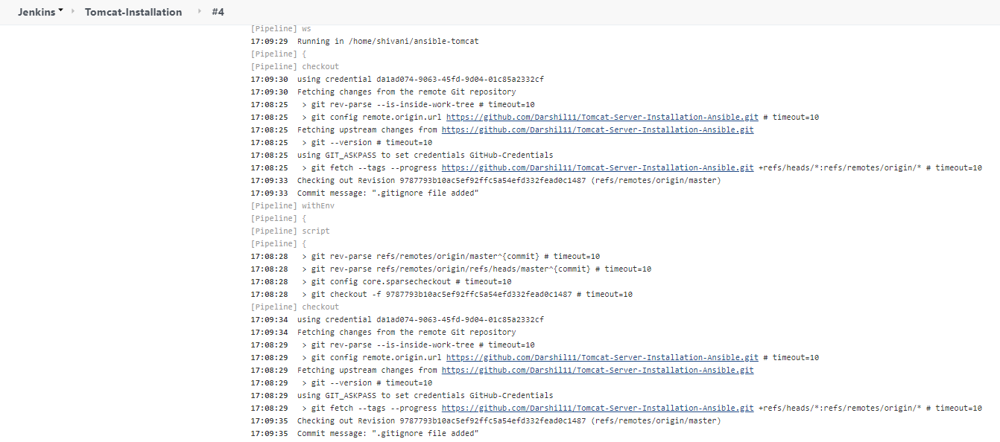
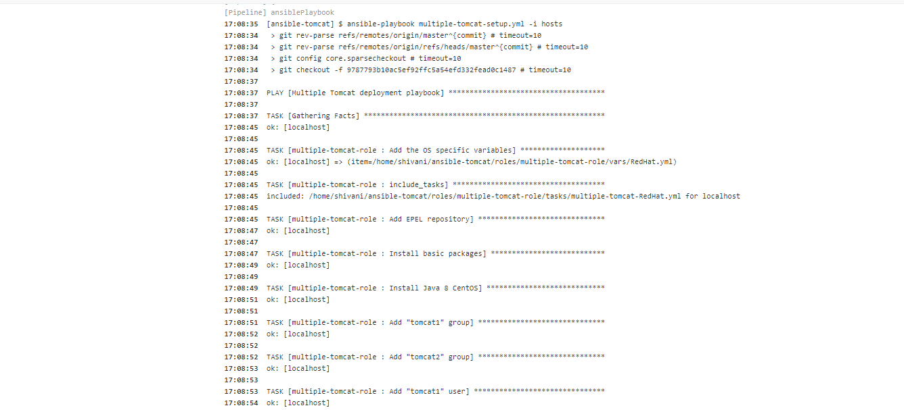
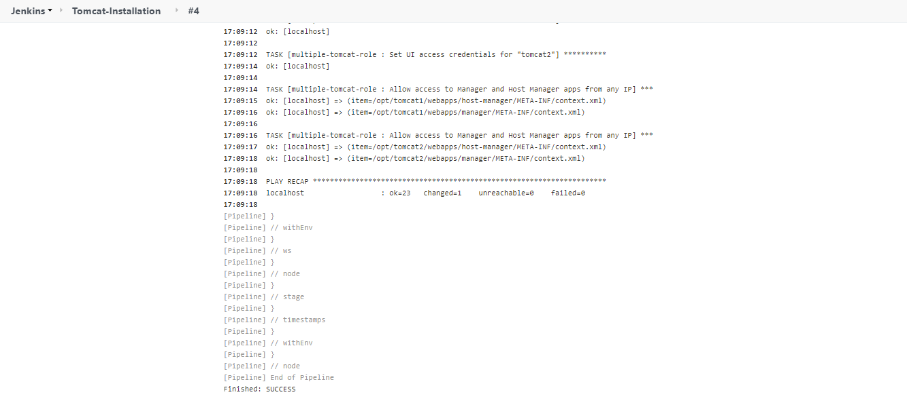

# Multiple Tomcat Server Installation using Ansible 
This project will guide you to the Installation of Multiple Tomcat servers on the same machine using Ansible role along with its deployment using Jenkins.

This Ansible role supports installation of Tomcat 9 on RedHat and Debian Operating Systems.

# Step 1: Install Ansible

*** CentOS ***
```
sudo yum -y install epel-release && sudo yum -y install ansible
```

*** Ubuntu / Linux Mint ****
```
sudo apt -y update
sudo apt -y install software-properties-common
sudo apt-add-repository --yes --update ppa:ansible/ansible
sudo apt update
sudo apt -y install ansible
```

*** Verfiy Ansible Installation ***
```
ansible --version

  ansible 2.9.6
  config file = /root/multiple-tomcat/ansible.cfg
  configured module search path = [u'/root/.ansible/plugins/modules', u'/usr/share/ansible/plugins/modules']
  ansible python module location = /usr/lib/python2.7/site-packages/ansible
  executable location = /usr/bin/ansible
  python version = 2.7.5
```

# Step 2: Clone Ansible role 

```
git clone https://github.com/Darshil11/Tomcat-Server-Installation-Ansible.git
cd multiple-tomcat
```

* By default Ansible will execute the installation on local host if you want to install on other servers change the IP of server in  hosts file.

* By default this role will install the 2 instances of tomcat 9 server on a single machine accessible over 8080 and 8081 ports.
* Variables related to multiple instance configuration, Tomcat version, server.xml file configuration for different instances, ports can be changed in file mentioned below.


```
cat multiple-tomcat-setup.yml
---
- name: Multiple Tomcat deployment playbook
  hosts: ansible-tomcat-nodes
  remote_user: root
  vars:
    tomcat_instance1_name: tomcat1
    tomcat_instance1_install_path: /opt
    tomcat_instance1_port_connector: 8080
    tomcat_instance1_port_shutdown: 8005
    tomcat_instance1_port_redirect: 8443
    tomcat_instance1_port_ajp: 8009
    tomcat_instance1_port_debug: 8000
    tomcat_instance2_install_path: /opt
    tomcat_instance2_name: tomcat2
    tomcat_instance2_port_connector: 8081
    tomcat_instance2_port_shutdown: 8006
    tomcat_instance2_port_redirect: 8444
    tomcat_instance2_port_ajp: 8010
    tomcat_instance2_port_debug: 8001
    tomcat_ver: 9.0.30   
```

NOTE: If you are using a non root user then update the sudo username in mentioned file.

# Step 3: Install Multiple Tomcat 9 with Ansible role:

* If you have a ssh key for a server execute below command to install Ansible role
```
ansible-playbook -i hosts multiple-tomcat-setup.yml
```
* If you have only root user - with password
```
ansible-playbook -i hosts multiple-tomcat-setup.yml --ask-pass
```
* sudo user - with password:
```
ansible-playbook -i hosts tomcat-setup.yml --ask-pass --ask-become-pass
```

# Step 4: Verfication of Multiple Tomcat 9 deployment:

* On successful completion of installation you should get logs attchaed below.
```
ansible-playbook -i hosts multiple-tomcat-setup.yml --ask-pass
SSH password:

PLAY [Multiple Tomcat deployment playbook] *****************************************************************************************

TASK [Gathering Facts] *************************************************************************************************************
ok: [localhost]

TASK [multiple-tomcat-role : Add the OS specific variables] ************************************************************************
ok: [localhost] => (item=/root/multiple-tomcat/roles/multiple-tomcat-role/vars/RedHat.yml)

TASK [multiple-tomcat-role : include_tasks] ****************************************************************************************
included: /root/multiple-tomcat/roles/multiple-tomcat-role/tasks/multiple-tomcat-RedHat.yml for localhost

TASK [multiple-tomcat-role : Add EPEL repository] **********************************************************************************
ok: [localhost]

TASK [multiple-tomcat-role : Install basic packages] *******************************************************************************
ok: [localhost]

TASK [multiple-tomcat-role : Install Java 8 CentOS] ********************************************************************************
ok: [localhost]

TASK [multiple-tomcat-role : Add "tomcat1" group] **********************************************************************************
ok: [localhost]

TASK [multiple-tomcat-role : Add "tomcat2" group] **********************************************************************************
ok: [localhost]

TASK [multiple-tomcat-role : Add "tomcat1" user] ***********************************************************************************
ok: [localhost]

TASK [multiple-tomcat-role : Add "tomcat2" user] ***********************************************************************************
ok: [localhost]

TASK [multiple-tomcat-role : Download Tomcat] **************************************************************************************
ok: [localhost]

TASK [multiple-tomcat-role : Create a tomcat1 directory] ***************************************************************************
ok: [localhost]

TASK [multiple-tomcat-role : Create a "tomcat2" directory] *************************************************************************
ok: [localhost]

TASK [multiple-tomcat-role : Extract "tomcat1" archive] ****************************************************************************
skipping: [localhost]

TASK [multiple-tomcat-role : Extract "tomcat2" archive] ****************************************************************************
skipping: [localhost]

TASK [multiple-tomcat-role : Copy "tomcat1" service file] **************************************************************************
ok: [localhost]

TASK [multiple-tomcat-role : Copy "tomcat2" service file] **************************************************************************
ok: [localhost]

TASK [multiple-tomcat-role : Copy "tomcat1" server file] ***************************************************************************
fatal: [localhost]: FAILED! => {"changed": false, "msg": "AnsibleUndefinedVariable: 'tomcat__instance1_port_connector' is undefined"}

PLAY RECAP *************************************************************************************************************************
localhost                  : ok=15   changed=0    unreachable=0    failed=1    skipped=2    rescued=0    ignored=0

[root@platform-test-2 multiple-tomcat]# ansible-playbook -i hosts multiple-tomcat-setup.yml --ask-pass
SSH password:
[DEPRECATION WARNING]: The TRANSFORM_INVALID_GROUP_CHARS settings is set to allow bad characters in group names by default, this
will change, but still be user configurable on deprecation. This feature will be removed in version 2.10. Deprecation warnings can
be disabled by setting deprecation_warnings=False in ansible.cfg.
[WARNING]: Invalid characters were found in group names but not replaced, use -vvvv to see details

PLAY [Multiple Tomcat deployment playbook] *****************************************************************************************

TASK [Gathering Facts] *************************************************************************************************************
ok: [localhost]

TASK [multiple-tomcat-role : Add the OS specific variables] ************************************************************************
ok: [localhost] => (item=/root/multiple-tomcat/roles/multiple-tomcat-role/vars/RedHat.yml)

TASK [multiple-tomcat-role : include_tasks] ****************************************************************************************
included: /root/multiple-tomcat/roles/multiple-tomcat-role/tasks/multiple-tomcat-RedHat.yml for localhost

TASK [multiple-tomcat-role : Add EPEL repository] **********************************************************************************
ok: [localhost]

TASK [multiple-tomcat-role : Install basic packages] *******************************************************************************
ok: [localhost]

TASK [multiple-tomcat-role : Install Java 8 CentOS] ********************************************************************************
ok: [localhost]

TASK [multiple-tomcat-role : Add "tomcat1" group] **********************************************************************************
ok: [localhost]

TASK [multiple-tomcat-role : Add "tomcat2" group] **********************************************************************************
ok: [localhost]

TASK [multiple-tomcat-role : Add "tomcat1" user] ***********************************************************************************
ok: [localhost]

TASK [multiple-tomcat-role : Add "tomcat2" user] ***********************************************************************************
ok: [localhost]

TASK [multiple-tomcat-role : Download Tomcat] **************************************************************************************
ok: [localhost]

TASK [multiple-tomcat-role : Create a tomcat1 directory] ***************************************************************************
ok: [localhost]

TASK [multiple-tomcat-role : Create a "tomcat2" directory] *************************************************************************
ok: [localhost]

TASK [multiple-tomcat-role : Extract "tomcat1" archive] ****************************************************************************
skipping: [localhost]

TASK [multiple-tomcat-role : Extract "tomcat2" archive] ****************************************************************************
skipping: [localhost]

TASK [multiple-tomcat-role : Copy "tomcat1" service file] **************************************************************************
ok: [localhost]

TASK [multiple-tomcat-role : Copy "tomcat2" service file] **************************************************************************
ok: [localhost]

TASK [multiple-tomcat-role : Copy "tomcat1" server file] ***************************************************************************
ok: [localhost]

TASK [multiple-tomcat-role : Copy "tomcat2" service file] **************************************************************************
ok: [localhost]

TASK [multiple-tomcat-role : Start and enable "tomcat1"] ***************************************************************************
changed: [localhost]

TASK [multiple-tomcat-role : Start and enable "tomcat2"] ***************************************************************************
changed: [localhost]

TASK [multiple-tomcat-role : Set UI access credentials for "tomcat1"] **************************************************************
changed: [localhost]

TASK [multiple-tomcat-role : Set UI access credentials for "tomcat2"] **************************************************************
changed: [localhost]

TASK [multiple-tomcat-role : Allow access to Manager and Host Manager apps from any IP] ********************************************
ok: [localhost] => (item=/opt/tomcat1/webapps/host-manager/META-INF/context.xml)
ok: [localhost] => (item=/opt/tomcat1/webapps/manager/META-INF/context.xml)

TASK [multiple-tomcat-role : Allow access to Manager and Host Manager apps from any IP] ********************************************
ok: [localhost] => (item=/opt/tomcat2/webapps/host-manager/META-INF/context.xml)
ok: [localhost] => (item=/opt/tomcat2/webapps/manager/META-INF/context.xml)

RUNNING HANDLER [multiple-tomcat-role : restart "tomcat1"] *************************************************************************
changed: [localhost]

RUNNING HANDLER [multiple-tomcat-role : restart "tomcat2"] *************************************************************************
changed: [localhost]

PLAY RECAP *************************************************************************************************************************
localhost                  : ok=25   changed=6    unreachable=0    failed=0    skipped=2    rescued=0    ignored=0
```
Once the installation is completed verify the endpoint is available, One instance will be accessible on port 8080 and second instance will be accessible on port 8081. 

* Verify first instance



* Verify second instance



* Verify services are up and running 
  
  

* Verify ports form CLI




Congratulation you have successfully installed 2 Instances of Tomcat server running on a single machine without any pre configuration.


# Jenkins pipeline

NOTE: To execute Jenkins pipline for Ansible deployment it is requiresd to Install a ansible plugin on jenkins server.

* Please refer the Jenkins file for configuring jenkins pipeline for deployment of tomcat server using Jenkins.
* Jenkins file has two stages  1) Checkout 2) InstallTomcat
* During checkout stage code/role will be checkout on Jenkins server and after that using ansible playbook tomcat server will be          deployed on the host mentioned in ansible host file.









